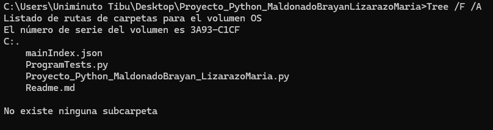

# Plataforma estudiantil.
En ese repositorio encontrarás una plataforma estudiantil en la que habrán tres opciones de entrada, las cuáles serán:
1. Camper
2. Trainer
3. Coordinador

# Descripción.
En la opción 1 el camper solo tendrá acceso a:
* Ver su ruta de estudio.
* Sus notas.
* Su horario.
* Su salón de clases.

En la opción 2 el Trainer solo tendrá acceso a:
* Ver los grupos a su cargo.

En la opción 3 el Coordinador solo tendrá acceso a:
* Registrar nuevo Camper.
* Ingresar Nota de la prueba inicial al Camper.
* Crear Ruta.
* Añadir Ruta de Estudio a los Campers, asignacion de trainer, salon y definicion de horario.
* Añadir Notas del Modulo a los Campers.

# Tecnologías utilizadas.
- Python
- Json

# Estructura del proyecto.

Allí aparece todo el código y lo demás utilizado para realizar la plataforma estudiantil. Iniciando, encontraras el archivo Json [mainIndex.json], luego encontraras dos Python uno en el que hayaras todo el código terminado y listo para ejecutar [Proyecto_Python_MaldonadoBrayan_LizarazoMaria.py] y como final, encontrarás éste documento explicativo del repositorio [Readme.md].